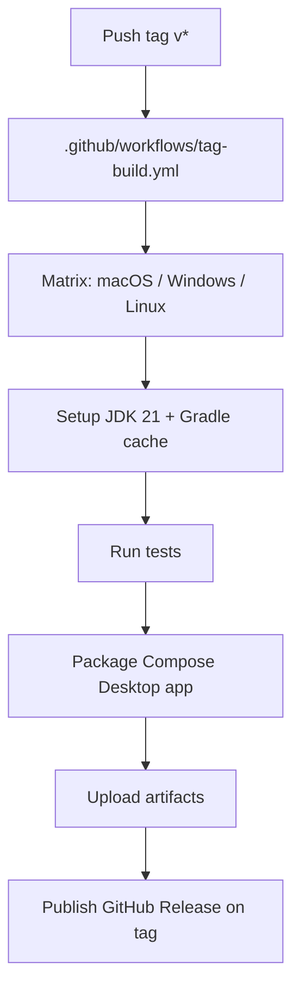

# Requirements

### Overview & Goals

Produce the **Sprint 7 planning documents** for the Junie Conversation Viewer project. Sprint 7 is a **CI/GitHub** sprint whose executed outcome will be: (1) a tag-triggered GitHub Actions build for the Compose Desktop app, (2) a GitHub-ready `README.md`, and (3) consolidation of existing how-to documentation.

The **deliverable of this task** is the two planning documents (a sprint document and a companion task-breakdown document) that describe and sequence that work in the established project style. No source, workflow, or README files are created/edited in this task — they are *planned* here and *implemented* during sprint execution.

### Scope

**In Scope**
- Create `docs/sprints/junie-conversation-viewer-sprint-7-ci-github-automation-and-readme.md`.
- Create `docs/tasks/junie-conversation-viewer-tasks-sprint-7-ci-github-automation-and-readme.md`.
- Match the structure, tone, front-matter, numbering, and level of detail of the Sprint 5 sprint & task docs.
- Fold in the confirmed HITL decisions (see Technical Design) and record remaining open questions with recommendations.
- Use project terminology consistently (Conversation, Session, Event, Message, Human, Junie, Search Query, Filter, Message Kind, HITL).

**Out of Scope (for this task)**
- Writing the actual `.github/workflows/*.yml`, the new `README.md`, or editing `build.gradle.kts` — these are tasks *inside* the planned sprint.
- Running builds or the workflow.

### User Stories
- As the **HITL**, I want a Sprint 7 sprint document that reads as a natural continuation of Sprints 0–6, so I can review scope, acceptance criteria, and open questions before implementation.
- As the **HITL**, I want a Sprint 7 task breakdown with trackable, marker-annotated tasks grouped by area, so implementation progress and review checkpoints are auditable.
- As **Junie** (implementer), I want each task to carry description, source, dependencies, likely files, completion criteria, and testing expectations, so the sprint can be executed unambiguously.

### Functional Requirements
- **FR1:** Both files use the exact required names and live under `docs/sprints/` and `docs/tasks/`.
- **FR2:** The sprint document contains: title, sprint goal, related documents, current baseline/assumptions, delivery areas, acceptance criteria, testing expectations, manual review expectations, out-of-scope/deferred items, risks & open questions, and HITL review checkpoints.
- **FR3:** The sprint document covers delivery areas: Discovery & Scope Confirmation; GitHub Actions Design; Tag Build Workflow Implementation; Versioning & Artifact Naming; GitHub README; Documentation Updates; Testing & Local Verification; Review, Cleanup & Completion.
- **FR4:** The task document mirrors the Sprint 5 task doc: related sprint, related documents table, purpose, how-to-use, progress summary, status legend, area-grouped task list, HITL checkpoints, acceptance criteria, deferred items, notes/decisions log.
- **FR5:** All new Sprint 7 tasks use unchecked boxes (`- [ ]`); each carries checkbox, description, source, dependencies, likely files/areas, completion criteria, testing expectations, and markers (`HITL Review`, `Test Required`, `Manual Review Required`, `Deferred`, `Depends on [task]`) where appropriate.
- **FR6:** The docs encode the confirmed CI decisions: cross-platform matrix (macOS + Windows + Linux), GitHub Release publishing on tags, and tag-in-artifact-names versioning (leave `packageVersion` unchanged).
- **FR7:** The docs explicitly include a task to **discover and confirm the exact Compose Desktop packaging/build Gradle task name(s)** before hard-coding them.
- **FR8:** The README plan incorporates/subsumes `docs/HOW_TO_USE.md` content and lists all required README sections and badges.

### Non-Functional Requirements
- **NFR1:** Documents render correctly as GitHub-flavored Markdown (tables, checkboxes, relative links resolve).
- **NFR2:** Terminology and naming conventions are consistent with existing docs.
- **NFR3:** Planning stays practical and implementation-oriented; prefer a small, reliable workflow described clearly over an over-engineered pipeline.

# Technical Design

### Current Implementation (investigation findings)

- **Project layout:** Gradle multi-module Kotlin Multiplatform project rooted at `JunieConversationViewer/` with `:desktopApp` (Compose Desktop, JVM) and `:shared`. Version catalog at `gradle/libs.versions.toml` (Kotlin 2.4.0, Compose Multiplatform 1.11.1). Java toolchain 21. Gradle wrapper present; `org.gradle.configuration-cache=true`, `org.gradle.caching=true`.
- **Compose Desktop packaging** (`desktopApp/build.gradle.kts`): `compose.desktop.application` with `mainClass = com.knowledgespike.junieviewer.MainKt`, `targetFormats(TargetFormat.Dmg, TargetFormat.Msi, TargetFormat.Deb)`, `packageName = com.knowledgespike.junieviewer`, `packageVersion = 1.0.0`. This implies packaging tasks `:desktopApp:packageDmg` / `:desktopApp:packageMsi` / `:desktopApp:packageDeb`, plus `:desktopApp:createDistributable` / `:desktopApp:packageDistributionForCurrentOS`, with outputs under `desktopApp/build/compose/binaries/main/`. **Exact task names must be confirmed during Area 1 discovery, not assumed.**
- **Test commands:** `./gradlew :shared:jvmTest` and `./gradlew test`.
- **Existing docs:** `README.md` already GitHub-shaped (features list). `docs/HOW_TO_USE.md` holds detailed usage (sessions, toolbar/menu, shortcuts, filters, live auto-refresh). Sessions read from `~/.junie/sessions/`; logs written to `~/.junieviewer/logs/`. Supporting docs: `RECAP.md`, `project_memory.md`, `TESTING.md`, `UBIQUITOUS-LANGUAGE.md`, ADRs.
- **Doc conventions (from Sprint 5):** Sprint docs use YAML front-matter (`sprint`, `name`, `status`) then numbered `#` sections; task docs use a related-documents table, a progress-summary table, a status legend, area-grouped tasks each with fixed fields, and a dated notes/decisions log. Earlier sprints also produced a `docs/sprint-N-area-1-discovery-findings.md`.

### Reference CI (LogViewer `build.yml`) — what to adapt
- Triggers: `workflow_dispatch`, `push` to `main` and `tags: ['v*']`, and PRs. Junie Sprint 7 focuses on the **tag** trigger (`v*`).
- `actions/setup-java@v5` with `java-version: '21'`, `distribution: 'temurin'`, `cache: 'gradle'`.
- `strategy.matrix` across `ubuntu-latest`, `ubuntu-24.04-arm`, `windows-latest`, `macos-latest` with per-OS `package-task` (`packageDeb`/`packageMsi`/`packageDmg`) and installer/dist paths.
- Linux needs `xvfb` + GL libs, and tests run under `xvfb-run`.
- Steps: checkout → JDK → (quality gate) → tests → package installer → `createDistributable` → zip/prepare artifacts → `actions/upload-artifact` → on tags: SHA256 checksums + `softprops/action-gh-release`.
- **Adaptation notes:** LogViewer module is `:app`; Junie module is `:desktopApp`. Paths become `desktopApp/build/compose/binaries/main/...`. Junie has no Detekt gate configured — drop the Detekt steps unless discovery finds one. Artifact base name should be `JunieConversationViewer` (not `KLogViewer`).

### Key Decisions (confirmed with HITL)
- **D1 — Platform scope:** Full cross-platform matrix (macOS + Windows + Linux) from the first workflow, mirroring LogViewer's matrix (dmg/msi/deb, plus Linux Xvfb handling).
- **D2 — Release publishing:** The tag build **publishes a GitHub Release** with attached installers/distributables (via a `gh-release` action), gated on `refs/tags/`.
- **D3 — Versioning:** Keep Gradle `packageVersion = 1.0.0` unchanged this sprint; embed the git tag (e.g. `v1.2.0`) only in **artifact/release names**. True tag-driven `packageVersion` is **deferred**.
- **D4 — Task name safety:** A discovery task must confirm the exact Compose packaging/build task names and output paths before they are hard-coded into the workflow.

### Open Questions to record in the sprint doc (with recommendations)
- **Q — Workflow filename:** `.github/workflows/tag-build.yml`. *Rec: yes.*
- **Q — Also build on `main`/PR for CI feedback, or tag-only?** *Rec: keep Sprint 7 tag-focused; note optional PR-CI as a low-risk add if trivial.*
- **Q — Prerelease detection:** treat tags containing `-` (e.g. `v1.0.0-rc1`) as prerelease. *Rec: yes, mirror LogViewer.*
- **Q — Which docs to cross-link/update after README rewrite** (`HOW_TO_USE`, `RECAP`, `project_memory`, `TESTING`). *Rec: README summarizes usage and links to `HOW_TO_USE.md` as the full reference.*

### Proposed Changes (this task's actual output)
Two new Markdown documents authored to project conventions:

1. **Sprint document** — front-matter (`sprint: 7`, `name: CI/GitHub Automation and GitHub README`, `status: planned`) + numbered sections: Title; Related Documents; Sprint Goal; Current Baseline & Assumptions; Design Findings (LogViewer adaptation, packaging task discovery, matrix/Xvfb notes); Scope; Out of Scope / Deferred; User Stories; Delivery Areas 1–8 (each with objective, files/areas, 'After' outcome); Acceptance Criteria; Testing Expectations; Manual Review Expectations; Risks & Mitigations; Open Questions (with recommendations); HITL Review Checkpoints; Definition of Done.
2. **Task document** — Related Sprint; Related Documents table; Purpose; How to Use; Progress Summary table (all areas 0/N, not started); Task Status Legend; Implementation Task List grouped by the 8 areas with fully-specified unchecked tasks and markers; HITL Review Checkpoints table; Acceptance Criteria; Deferred/Out-of-Scope; Notes/Decisions Log seeded with the confirmed D1–D4 decisions.

### README content blueprint (planned inside the sprint, not written now)
Sections: title “Junie Conversation Viewer”; short description; badges (tag-build workflow status, Kotlin, Java 21, Compose Desktop, License only if a license exists/added); screenshot section/placeholder; Features; Installation / Getting Started; Run from source; Build/package locally (confirmed Gradle tasks); How to use (subsumes `HOW_TO_USE.md`, links to it for full detail); Keyboard shortcuts; Sessions read from `~/.junie/sessions/`; Logs written to `~/.junieviewer/logs/`; Troubleshooting; Development/testing commands; Documentation links; Status/limitations; Contributing.

### Delivery-area → workflow mapping (planned `tag-build.yml`)

### File Structure (new files created by THIS task)
- `docs/sprints/junie-conversation-viewer-sprint-7-ci-github-automation-and-readme.md` (new)
- `docs/tasks/junie-conversation-viewer-tasks-sprint-7-ci-github-automation-and-readme.md` (new)

### Risks
- **R1 — Packaging task-name drift:** Assumed `packageDmg/Msi/Deb` names may differ. *Mitigation:* mandatory Area 1 discovery task to confirm before hard-coding.
- **R2 — Style divergence:** New docs might not match prior sprints. *Mitigation:* directly mirror Sprint 5 doc structure and field set.
- **R3 — README/HOW_TO_USE contradiction:** *Mitigation:* README summarizes and links; `HOW_TO_USE.md` stays the authoritative usage reference.

# Validation

### Validation Approach
Because this task produces planning documents (not code), validation is structural and editorial rather than automated.

### Key Scenarios
- **Files exist & named correctly:** both documents present under `docs/sprints/` and `docs/tasks/` with the required filenames.
- **Sprint doc completeness:** every required section from the requirements is present (goal, baseline, delivery areas 1–8, acceptance criteria, testing & manual-review expectations, out-of-scope/deferred, risks & open questions, HITL checkpoints).
- **Task doc completeness:** related-docs table, purpose, how-to-use, progress summary, legend, area-grouped tasks, HITL checkpoints, acceptance criteria, deferred items, notes/decisions log all present; every task carries all required fields and appropriate markers; all Sprint 7 tasks are unchecked.
- **Decision fidelity:** D1 (full matrix), D2 (publish Release), D3 (tag-in-names, `packageVersion` unchanged) are reflected in both docs and seeded in the decisions log.
- **Discovery guard present:** a task explicitly requires confirming Compose packaging task names/paths before hard-coding.
- **Acceptance criteria alignment:** the CI/GitHub acceptance criteria from the issue (JDK 21, tests-before-package, confirmed Gradle tasks, artifact upload, tag-aware names, README readiness, `HOW_TO_USE` subsumption, `./gradlew test` & `:shared:jvmTest` pass, HITL review of workflow & README) appear in the sprint doc's Definition of Done.

### Edge Cases
- Relative Markdown links resolve to real existing files (Sprint 6 docs, `UBIQUITOUS-LANGUAGE.md`, `TESTING.md`, etc.).
- Terminology uses domain actors correctly (“Human”/“HITL” in domain context; “user/visitor” only in conventional README prose).
- GFM tables and checkbox lists render without syntax errors.

### Manual Review
- HITL reads both documents and confirms they read as a natural continuation of Sprints 0–6 before the sprint is executed.

# Delivery Steps

### ✓ Step 1: Author the Sprint 7 sprint document
A complete `docs/sprints/junie-conversation-viewer-sprint-7-ci-github-automation-and-readme.md` exists, styled like the Sprint 5 sprint doc.

- Add YAML front-matter (`sprint: 7`, `name: CI/GitHub Automation and GitHub README`, `status: planned`).
- Write numbered sections: Title; Related Documents (link Sprint 6, task doc, `UBIQUITOUS-LANGUAGE.md`, `RECAP.md`, `TESTING.md`, `project_memory.md`); Sprint Goal; Current Baseline & Assumptions (Gradle/module layout, Java 21, Kotlin 2.4, Compose Desktop, existing README/HOW_TO_USE, sessions/logs paths).
- Add Design Findings summarizing LogViewer `build.yml` adaptation (module `:desktopApp`, paths `desktopApp/build/compose/binaries/main/...`, matrix + Xvfb, drop Detekt).
- Document the 8 delivery areas (Discovery & Scope; GitHub Actions Design; Tag Build Workflow Implementation; Versioning & Artifact Naming; GitHub README; Documentation Updates; Testing & Local Verification; Review/Cleanup/Completion) each with objective, likely files, and an 'After' outcome.
- Add Scope, Out-of-Scope/Deferred (Homebrew, notarization/signing, auto-update, full semver automation, registry publishing, multi-repo orchestration), User Stories, Acceptance Criteria / Definition of Done, Testing & Manual-Review Expectations, Risks & Mitigations, Open Questions (with recommendations), and HITL Review Checkpoints.
- Encode confirmed decisions D1 (full macOS+Windows+Linux matrix), D2 (publish GitHub Release on tag), D3 (tag in artifact/release names, `packageVersion` unchanged), and require confirming exact packaging task names.

### ✓ Step 2: Author the Sprint 7 task breakdown document
A complete `docs/tasks/junie-conversation-viewer-tasks-sprint-7-ci-github-automation-and-readme.md` exists, mirroring the Sprint 5 task doc structure.

- Add Related Sprint section, Related Documents table, Purpose, How to Use, Progress Summary table (all 8 areas shown as not started), and Task Status Legend (`HITL Review`, `Test Required`, `Manual Review Required`, `Deferred`, `Depends on [task]`, `Blocked`).
- Create area-grouped, unchecked (`- [ ]`) tasks for all 8 areas, each task carrying: checkbox, description, source, dependencies, likely files/areas, completion criteria, and testing expectations.
- Area 1 must include an explicit task to discover and confirm the exact Compose Desktop packaging/build Gradle task names and output paths before hard-coding them, plus inspecting LogViewer workflows and existing README/`HOW_TO_USE.md`.
- Area 3 tasks describe adding `.github/workflows/tag-build.yml` (tag `v*` trigger, checkout, setup JDK 21, Gradle cache, run tests before packaging, matrix package tasks, artifact upload, clear tag-aware names, Release publishing).
- Area 5 tasks cover the GitHub README blueprint (title, description, badges, screenshot placeholder, features, install/run/build, usage subsuming `HOW_TO_USE.md`, shortcuts, sessions/logs paths, troubleshooting, dev/test commands, doc links, status, contributing).
- Area 7 tasks cover `./gradlew test`, `./gradlew :shared:jvmTest`, local package/build verification, artifact inspection, workflow-syntax review, and badge/link checks.
- Add HITL Review Checkpoints table, Acceptance Criteria, Deferred/Out-of-Scope items, and a Notes/Decisions Log seeded with confirmed decisions D1–D4.

### ✓ Step 3: Consistency pass and cross-linking
Both documents are internally consistent, correctly cross-referenced, and read as a natural continuation of Sprints 0–6.

- Verify the sprint doc and task doc reference each other with correct relative paths and that all linked docs exist.
- Confirm delivery areas in the sprint doc map one-to-one to task areas in the task doc.
- Ensure terminology (Conversation, Session, Event, Message, Human, Junie, Search Query, Filter, Message Kind, HITL) is used consistently, using ‘Human’/‘HITL’ for the domain actor and ‘user/visitor’ only in conventional README prose references.
- Confirm acceptance criteria in both docs align with the issue's CI/GitHub acceptance list and that all Sprint 7 tasks remain unchecked.
- Proofread for GitHub-flavored Markdown correctness (tables, checkboxes, front-matter, headings).