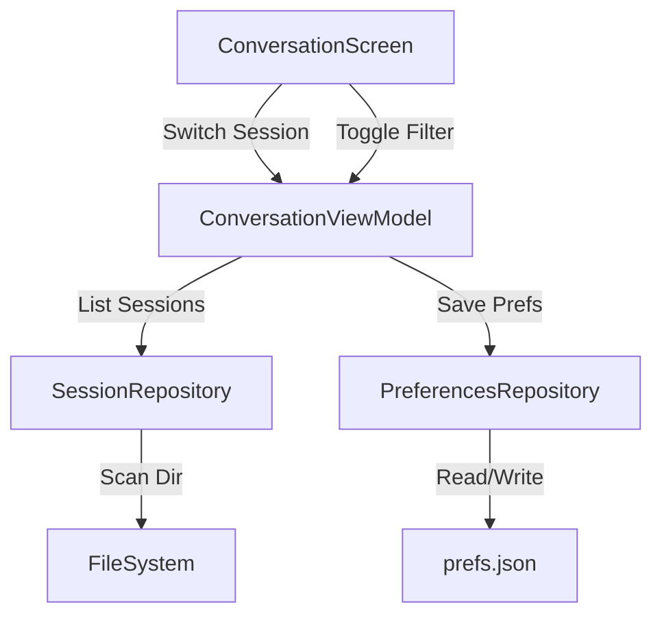

# Requirements

### Overview & Goals
The goal of this sprint is to transition the application from a "Hardcoded Prototype" to a "Functional Utility" by removing environment-specific paths and enhancing the discoverability and navigability of conversation logs.

### Scope
- **In Scope**:
    - Dynamic session discovery in `~/.junie/sessions/`.
    - Session selection UI.
    - Persistence of user preferences (paths, last session).
    - Metadata-based filtering (Human vs. Junie, Thoughts, Tools).
- **Out Scope**:
    - Real-time file tailing (deferred to a future sprint).
    - Specialized rendering for Plans and Diffs (deferred).

### User Stories
- **As a developer**, I want to browse all my Junie sessions so I can quickly find the one I need to review without editing code.
- **As a user**, I want the app to remember the last session I opened so I don't have to navigate to it every time.
- **As a user**, I want to filter the log to show only tool calls or human prompts so I can quickly diagnose specific parts of the conversation.

### Questions for Sprint Improvement
To evaluate and improve any sprint in this project, consider these questions:
1. **Portability**: Does the app rely on hardcoded paths or environment-specific assumptions that prevent it from running on another machine?
2. **Data Fidelity**: Does the UI accurately represent the sequence and status of events in the `events.jsonl` file, or is information lost/cluttered during mapping?
3. **Navigability**: How many clicks does it take for a user to find a specific event in a 1,000-line log?
4. **Resilience**: How does the app handle malformed JSONL lines or unexpectedly large log files?
5. **Contextual Awareness**: Does the UI provide enough context for "Junie's" actions (e.g., showing which tool was called and why)?

# Technical Design

### Current Implementation
- `SessionRepositoryImpl` uses a hardcoded absolute path to a specific session.
- `AppPreferences` only stores window dimensions.
- `ConversationViewModel` only filters by text content.

### Key Decisions
- **Session Discovery**: We will use `okio` to scan `~/.junie/sessions/` for directories. Each directory name (the session ID) and its creation date will be used for selection.
- **Preference Storage**: We will extend the existing `PreferencesRepository` to store the base Junie home path and the last used session ID.
- **Filtering Logic**: Metadata filtering will be performed in-memory within the `ViewModel`, similar to the current search query, to ensure high responsiveness.

### Proposed Changes

#### Data & Domain
- **`AppPreferences`**: Add `junieHomePath: String` and `lastSessionId: String?`.
- **`SessionRepository`**: 
    - `fun listSessions(): List<SessionInfo>`
    - `fun setSession(sessionId: String)`
- **`SessionInfo`**: New domain model containing `id`, `path`, and `lastModified`.

#### UI Components
- **`SessionSelector`**: A new composable (dropdown or modal) to switch between sessions.
- **`FilterBar`**: A row of chips (Human, Thought, Tool, Diff) to toggle visibility of different message types.

### File Structure
- `shared/src/commonMain/kotlin/.../domain/SessionInfo.kt` (New)
- `shared/src/commonMain/kotlin/.../ui/components/SessionSelector.kt` (New)
- `shared/src/commonMain/kotlin/.../ui/components/FilterBar.kt` (New)
- `shared/src/commonMain/kotlin/.../data/SessionRepository.kt` (Modified)
- `shared/src/commonMain/kotlin/.../ui/ConversationViewModel.kt` (Modified)

### Architecture Diagram

# Delivery Steps

### ✓ Step 1: Implement Session Browser and Dynamic Loading
Introduce `AppPreferences` fields and update the UI to allow browsing and selecting sessions.

- Update `AppPreferences` to include `junieHomePath` (defaulting to `~/.junie`).
- Add `SessionRepository.listSessions()` to scan the `sessions` directory.
- Create a `SessionPicker` component (or screen) to display available sessions with timestamps.
- Update `SessionRepositoryImpl` to accept a dynamic path instead of a hardcoded string.

### ✓ Step 2: Persist Session Preferences and Home Path
Ensure the application remembers the last viewed session and user settings.

- Update `PreferencesRepository` to save the `lastSessionId`.
- Modify `ConversationViewModel` to load the `lastSessionId` on startup.
- Add a configuration screen to edit the `junieHomePath` if it differs from the default.

### ✓ Step 3: Implement Metadata Filtering and UI Toggles
Extend the search logic to allow filtering by sender and event type.

- Add `FilterState` to `ConversationState` (e.g., `showHuman`, `showJunie`, `showTools`).
- Update `ConversationViewModel.filterMessages` to apply metadata filters alongside the text query.
- Add UI "Filter Chips" to the `ConversationScreen` for quick toggling of message types.