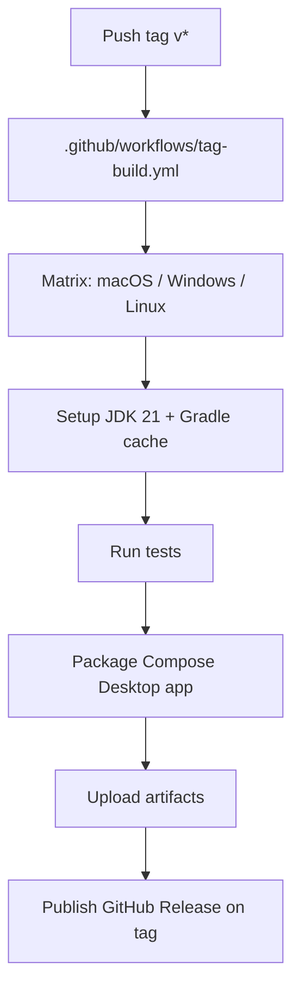

# 1. Title

Sprint 7 — CI/GitHub Automation and GitHub README

# 2. Related Documents

- [`docs/sprints/junie-conversation-viewer-sprint-6-code-quality-remediation.md`](junie-conversation-viewer-sprint-6-code-quality-remediation.md) — the preceding sprint; Sprint 7 builds on its remediated, green-build baseline.
- [`docs/tasks/junie-conversation-viewer-tasks-sprint-7-ci-github-automation-and-readme.md`](../tasks/junie-conversation-viewer-tasks-sprint-7-ci-github-automation-and-readme.md) — the companion task breakdown for this sprint.
- [`docs/HOW_TO_USE.md`](../HOW_TO_USE.md) — detailed usage reference that the new GitHub README will summarize and subsume.
- [`docs/UBIQUITOUS-LANGUAGE.md`](../UBIQUITOUS-LANGUAGE.md) — canonical domain terms used consistently in code, tests, and UI copy.
- [`docs/RECAP.md`](../RECAP.md) — chronological project history.
- [`docs/TESTING.md`](../TESTING.md) — testing stack, Robot pattern, semantic `testTag` conventions, and Gradle commands.
- [`docs/project_memory.md`](../project_memory.md) — decisions, gotchas, and shipped work.
- `LogViewer/.github/workflows/build.yml` (external reference project) — a Compose Desktop CI/release workflow adapted, not copied, for this sprint.

# 3. Sprint Goal

Give the Junie Conversation Viewer a GitHub-facing presence: a tag-triggered GitHub Actions workflow that builds and packages the Compose Desktop application across macOS, Windows, and Linux and publishes a GitHub Release on version tags, plus a GitHub-ready `README.md` that describes the project, carries relevant badges, and subsumes the existing `docs/HOW_TO_USE.md` usage guidance while linking to it as the full reference.

# 4. Current Baseline

## 4.1 Project and Module Layout

- Gradle multi-module Kotlin Multiplatform project rooted at `JunieConversationViewer/` with two modules: `:desktopApp` (Compose Desktop, JVM entry point) and `:shared` (domain, parsing, ViewModel, UI composables).
- Version catalog at `gradle/libs.versions.toml` (Kotlin 2.4.0, Compose Multiplatform 1.11.1). Java toolchain 21.
- Gradle wrapper present (`gradlew`, `gradlew.bat`); `org.gradle.configuration-cache=true` and `org.gradle.caching=true` in `gradle.properties`.

## 4.2 Compose Desktop Packaging

- `desktopApp/build.gradle.kts` configures `compose.desktop.application` with `mainClass = "com.knowledgespike.junieviewer.MainKt"`, `targetFormats(TargetFormat.Dmg, TargetFormat.Msi, TargetFormat.Deb)`, `packageName = "com.knowledgespike.junieviewer"`, and `packageVersion = "1.0.0"`.
- This implies packaging tasks `:desktopApp:packageDmg` / `:desktopApp:packageMsi` / `:desktopApp:packageDeb`, plus `:desktopApp:createDistributable` and `:desktopApp:packageDistributionForCurrentOS`, with outputs under `desktopApp/build/compose/binaries/main/`. **These exact names and paths must be confirmed during Area 1 discovery, not assumed.**

## 4.3 Testing Baseline

- Known test commands: `./gradlew :shared:jvmTest` (shared module JVM tests) and `./gradlew test` (full suite). Sprint 6 left the build green.
- No Detekt or other quality-gate plugin is configured in this project (unlike the LogViewer reference), so no quality-gate step is required.

## 4.4 Documentation Baseline

- `README.md` at the repository/module root already lists features but is not yet a full GitHub-ready README (badges, install/run/build, troubleshooting, doc links).
- `docs/HOW_TO_USE.md` holds detailed usage: Session selection, toolbar/menu controls, keyboard shortcuts, Filters, sort order, collapse/show all, and live auto-refresh behaviour.
- Sessions are read from `~/.junie/sessions/`; application logs are written to `~/.junieviewer/logs/`.
- Supporting docs: `docs/RECAP.md`, `docs/project_memory.md`, `docs/TESTING.md`, `docs/UBIQUITOUS-LANGUAGE.md`, and ADRs under `docs/adr/`.

## 4.5 CI/GitHub Baseline

- The repository currently has **no** `.github/workflows/` directory and no CI. There are no existing status badges.

# 5. Design Findings

## 5.1 LogViewer `build.yml` — What to Adapt

The reference LogViewer project ships a mature Compose Desktop CI/release workflow. The reusable, adaptable elements are:

- **Triggers:** `workflow_dispatch`, `push` to `main`, `push` on `tags: ['v*']`, and pull requests. Sprint 7 focuses on the **tag** trigger (`v*`).
- **JDK setup:** `actions/setup-java@v5` with `java-version: '21'`, `distribution: 'temurin'`, `cache: 'gradle'`.
- **Matrix:** builds across `ubuntu-latest`, `ubuntu-24.04-arm`, `windows-latest`, and `macos-latest`, each with a per-OS `package-task` (`packageDeb` / `packageMsi` / `packageDmg`) and per-OS installer/distributable paths.
- **Linux specifics:** installs `xvfb` and GL libraries; runs tests under `xvfb-run` because Compose Desktop needs a display.
- **Step flow:** checkout → JDK setup → (quality gate) → tests → package installer → `createDistributable` → zip/prepare artifacts → `actions/upload-artifact` → on tags: SHA256 checksums + `softprops/action-gh-release`.

## 5.2 Adaptation Notes for Junie Conversation Viewer

- LogViewer's Compose module is `:app`; the Junie equivalent is `:desktopApp`. All task and path references become `:desktopApp:...` and `desktopApp/build/compose/binaries/main/...`.
- Junie has **no Detekt gate** — drop the Detekt / "Enforce Quality Gate" steps unless Area 1 discovery finds an equivalent.
- Artifact and Release names should use the base name `JunieConversationViewer` (not `KLogViewer`).
- Tests must run with `./gradlew :shared:jvmTest` (and/or `./gradlew test`) before packaging, under `xvfb-run` on Linux.
- Keep the first workflow small and reliable: prefer a clearly readable matrix over an over-engineered pipeline.

## 5.3 Packaging Task Discovery (Guard)

Because the workflow hard-codes Gradle task names and output paths, Area 1 must run `./gradlew :desktopApp:tasks` (or equivalent) to confirm the exact packaging/build task names and the on-disk locations of the produced `.dmg` / `.msi` / `.deb` and distributable before those values are written into the workflow.

# 6. Scope

- **Tag-triggered workflow:** A `.github/workflows/tag-build.yml` that runs on `v*` tag pushes, sets up JDK 21 with Gradle caching, runs tests, then packages the Compose Desktop app.
- **Cross-platform matrix (D1):** Build and package on macOS (`.dmg`), Windows (`.msi`), and Linux (`.deb`, with Xvfb) from the first workflow.
- **Artifact upload:** Upload the packaged installers and distributables as workflow artifacts with clear, tag-aware names.
- **GitHub Release publishing (D2):** On tag builds, publish a GitHub Release with the installers/distributables attached, gated on `refs/tags/`.
- **Tag-aware naming (D3):** Embed the git tag (e.g. `v1.2.0`) in artifact and Release names while leaving Gradle `packageVersion` unchanged this sprint.
- **GitHub README:** Create/rewrite the root `README.md` to be GitHub-ready, with badges, features, install/run/build guidance, usage (subsuming `HOW_TO_USE.md`), shortcuts, sessions/logs paths, troubleshooting, doc links, status, and contributing notes.
- **Documentation consolidation:** Cross-link/update supporting docs (`HOW_TO_USE.md`, `RECAP.md`, `project_memory.md`, `TESTING.md`) so they remain consistent with the new README.

# 7. Out of Scope / Deferred

- Automatic tag-driven `packageVersion` (true semantic-version automation) — **deferred**; `packageVersion` stays `1.0.0` this sprint.
- Code signing and notarization (macOS) and Windows installer signing.
- Linux package-repository publishing (apt/rpm repos).
- Homebrew formula / cask.
- Auto-update mechanism inside the app.
- Publishing to package registries (Maven Central, GitHub Packages, etc.).
- Multi-repository release orchestration.
- Adding a software license (README license badge only if a license file is added/exists).

# 8. User Stories

- As a **Human** browsing the project on GitHub, I want a clear, badge-rich README so I can quickly understand what the Junie Conversation Viewer is and how to install and run it.
- As the **HITL**, I want a tag push to automatically build and package the Compose Desktop app on macOS, Windows, and Linux, so I can distribute installers without manual per-platform builds.
- As the **HITL**, I want a GitHub Release published on each version tag with the installers attached, so downloads have a stable, discoverable home.
- As **Junie** (implementer), I want the workflow to run tests before packaging, so broken builds never produce a Release.
- As a **Human** new to the app, I want the README to summarize usage and link to `docs/HOW_TO_USE.md` for the full reference, so I am not lost between two conflicting documents.

# 9. Functional Requirements

- **FR1:** A workflow file `.github/workflows/tag-build.yml` triggers on pushes of tags matching `v*`.
- **FR2:** The workflow sets up JDK 21 (Temurin) with Gradle caching enabled.
- **FR3:** The workflow runs the project's tests (`:shared:jvmTest` and/or `test`) **before** any packaging step; a test failure fails the job.
- **FR4:** The workflow packages the Compose Desktop application using the **confirmed** Gradle packaging task(s) for each OS in the matrix.
- **FR5:** The build matrix covers macOS (`.dmg`), Windows (`.msi`), and Linux (`.deb`), with Linux running tests/packaging under Xvfb.
- **FR6:** The workflow uploads the produced installers/distributables as artifacts using clear, tag-aware names based on `JunieConversationViewer` and the tag.
- **FR7:** On tag builds, the workflow publishes a GitHub Release (gated on `refs/tags/`) with the installers/distributables attached.
- **FR8:** The git tag is embedded in artifact/Release names; Gradle `packageVersion` remains `1.0.0`.
- **FR9:** The root `README.md` is GitHub-ready and contains: title, short description, badges, screenshot section/placeholder, features, installation/getting started, run from source, build/package locally, usage, keyboard shortcuts, sessions path (`~/.junie/sessions/`), logs path (`~/.junieviewer/logs/`), troubleshooting, development/testing commands, documentation links, status/limitations, and contributing notes.
- **FR10:** The README incorporates or subsumes the content of `docs/HOW_TO_USE.md`, summarizing usage and linking to it for full detail without contradictory instructions.
- **FR11:** Badges reflect real project facts: tag-build workflow status, Kotlin, Java 21, Compose Desktop; a License badge is added only if a license exists/added.

# 10. Non-Functional Requirements

- **NFR1:** The workflow is small, readable, and maintainable — a clearly structured matrix over an over-engineered pipeline.
- **NFR2:** All Markdown renders correctly as GitHub-flavored Markdown (tables, checkboxes, relative links resolve, badges display).
- **NFR3:** Terminology is consistent with existing docs (Conversation, Session, Event, Message, Human, Junie, Search Query, Filter, Message Kind, HITL); "user/visitor" is used only in conventional README prose.
- **NFR4:** The workflow does not depend on secrets beyond the default `GITHUB_TOKEN` for Release publishing.
- **NFR5:** Gradle task names and output paths in the workflow are confirmed by discovery, not assumed.

# 11. Design Principles

1. **Small, Reliable First Workflow.** Prefer a workflow that is easy to read and maintain over a large release pipeline.
2. **Confirm Before Hard-Coding.** Verify Gradle packaging task names and output paths before embedding them in YAML.
3. **Adapt, Don't Copy.** Reuse LogViewer patterns but tailor them to this project's `:desktopApp` module and naming.
4. **README as Front Door.** The README must stand on its own for GitHub visitors while linking `HOW_TO_USE.md` as the authoritative usage reference.
5. **Single Source of Usage Truth.** Avoid contradictory usage instructions between README and `HOW_TO_USE.md`.
6. **Tag-Driven, Version-Stable.** Tags drive builds and naming; the Gradle `packageVersion` change is deferred to avoid risk this sprint.

# 12. Incremental Delivery Plan

## Area 1 — Discovery and Scope Confirmation
- **Objective:** Confirm the Gradle project structure, the exact Compose Desktop packaging/build task names and output paths, existing README/`HOW_TO_USE.md` content and current badges (none), and inspect the LogViewer workflows to identify reusable elements and open questions.
- **Files / areas:** `desktopApp/build.gradle.kts`, `gradle/libs.versions.toml`, `gradle.properties`, `README.md`, `docs/HOW_TO_USE.md`, LogViewer `.github/workflows/`.
- **After:** *The HITL sees documented, confirmed packaging tasks/paths and a clear list of reusable CI elements and open questions.*

## Area 2 — GitHub Actions Workflow Design
- **Objective:** Define the desired tag-build workflow shape: trigger, JDK/cache setup, test step, matrix, per-OS package tasks, artifact naming, and Release publishing — capturing decisions D1–D4.
- **Files / areas:** Design notes / this sprint doc; draft of `.github/workflows/tag-build.yml`.
- **After:** *A reviewed workflow design exists and is approved before implementation.*

## Area 3 — Tag Build Workflow Implementation
- **Objective:** Add `.github/workflows/tag-build.yml` implementing the approved design (tag `v*` trigger, checkout, JDK 21, Gradle cache, tests before packaging, matrix package tasks, Xvfb on Linux, artifact upload, tag-aware names, Release publishing on tags).
- **Files / areas:** `.github/workflows/tag-build.yml`.
- **After:** *A tag push produces cross-platform installers and a published GitHub Release.*

## Area 4 — Versioning and Artifact Naming
- **Objective:** Implement tag-in-name versioning (D3): derive the tag string in the workflow and embed it in artifact/Release names while leaving `packageVersion` unchanged; document the deferred true-versioning path.
- **Files / areas:** `.github/workflows/tag-build.yml`, sprint/README notes.
- **After:** *Artifacts and Releases carry the tag (e.g. `v1.2.0`) in their names; Gradle `packageVersion` is untouched.*

## Area 5 — GitHub README
- **Objective:** Create/rewrite the root `README.md` per the blueprint (Section 13), subsuming `HOW_TO_USE.md` usage and adding badges once the workflow name is known.
- **Files / areas:** `README.md`.
- **After:** *A GitHub visitor can understand, install, run, and use the app from the README alone.*

## Area 6 — Documentation Updates
- **Objective:** Cross-link and update supporting docs so they stay consistent with the new README and CI: `HOW_TO_USE.md` (link back from/into README), `RECAP.md`, `project_memory.md`, `TESTING.md`.
- **Files / areas:** `docs/HOW_TO_USE.md`, `docs/RECAP.md`, `docs/project_memory.md`, `docs/TESTING.md`.
- **After:** *Docs cross-reference the README/CI without contradictions.*

## Area 7 — Testing and Local Verification
- **Objective:** Verify the change locally and by inspection: run `./gradlew :shared:jvmTest` and `./gradlew test`, run the confirmed local package/build task, inspect produced artifacts, review workflow YAML syntax, and check README badge/link correctness.
- **Files / areas:** Whole project; `.github/workflows/tag-build.yml`; `README.md`.
- **After:** *Tests are green, a local package succeeds, and workflow/README are validated.*

## Area 8 — Review, Cleanup, and Completion
- **Objective:** HITL review checkpoints (discovery findings, workflow design, README content, final approval), a cyclomatic-complexity check per project guidelines, and completion updates to `README.md` and `project_memory.md`.
- **Files / areas:** Documentation; project delivery.
- **After:** *Sprint 7 is verified, reviewed, and signed off.*

# 13. GitHub README Blueprint

The new `README.md` should contain, in order:

1. **Title:** "Junie Conversation Viewer".
2. **Short description:** one or two sentences describing the desktop viewer for Junie Conversations/Sessions.
3. **Badges:** tag-build workflow status, Kotlin, Java 21, Compose Desktop; License only if a license file exists/added.
4. **Screenshot section / placeholder:** a placeholder image or note if no screenshots exist yet.
5. **Features:** high-level feature list (Session discovery, live auto-refresh, rich Message rendering, Search/Filter, toolbar/menu/shortcuts, theming).
6. **Installation / Getting Started:** how to obtain installers (from GitHub Releases once CI publishes them).
7. **Run from source:** the Gradle run command for the desktop app.
8. **Build / package locally:** the **confirmed** Gradle packaging tasks per OS.
9. **How to use:** a concise usage summary subsuming `docs/HOW_TO_USE.md`, linking to it for full detail.
10. **Keyboard shortcuts:** the shortcut table (or a summary linking to `HOW_TO_USE.md`).
11. **Sessions path:** Sessions are read from `~/.junie/sessions/`.
12. **Logs path:** logs are written to `~/.junieviewer/logs/`.
13. **Troubleshooting:** common issues (no Sessions found, live updates, logs location).
14. **Development / testing commands:** `./gradlew :shared:jvmTest`, `./gradlew test`.
15. **Documentation links:** links to `docs/HOW_TO_USE.md`, `docs/TESTING.md`, `docs/UBIQUITOUS-LANGUAGE.md`, sprint docs.
16. **Status / limitations:** current state and known limitations.
17. **Contributing:** brief contribution notes.

# 14. Delivery-Area → Workflow Mapping

# 15. Testing Expectations

- `./gradlew :shared:jvmTest` passes locally and in CI.
- `./gradlew test` passes locally and in CI.
- The confirmed local package/build task produces installers/distributables under `desktopApp/build/compose/binaries/main/` (path confirmed in Area 1).
- Workflow YAML is syntactically valid and passes review; the tag trigger and matrix are verified by inspection (and, where feasible, a real tag push on a branch/fork).
- README links resolve and badges render against the correct workflow name and default branch.

# 16. Manual Review Expectations

- **Discovery review:** HITL reviews confirmed packaging tasks/paths and open questions.
- **Workflow design review:** HITL approves the workflow design (matrix, Release publishing, naming) before implementation.
- **README review:** HITL reviews README content, badges, and `HOW_TO_USE.md` subsumption.
- **Release review:** HITL confirms a tag push produces the expected artifacts and Release (or reviews a dry run) before final sign-off.

# 17. Risks and Mitigations

- **R1 — Packaging task-name / path drift:** Assumed `packageDmg/Msi/Deb` names or output paths may differ. *Mitigation:* mandatory Area 1 discovery task to confirm before hard-coding into the workflow.
- **R2 — Linux display requirement:** Compose Desktop tests/packaging need a display on Linux. *Mitigation:* install and use `xvfb` / `xvfb-run`, mirroring LogViewer.
- **R3 — Release publishing permissions:** `softprops/action-gh-release` needs `contents: write`. *Mitigation:* set job/workflow `permissions: contents: write` and use the default `GITHUB_TOKEN`.
- **R4 — README / `HOW_TO_USE.md` contradiction:** two usage sources can diverge. *Mitigation:* README summarizes and links; `HOW_TO_USE.md` stays the authoritative usage reference.
- **R5 — Style divergence from prior sprints:** *Mitigation:* mirror the Sprint 5 sprint/task doc structure and field set.
- **R6 — Matrix complexity on first workflow:** full cross-platform matrix increases the failure surface. *Mitigation:* keep steps minimal and identical across OSs except for the per-OS package task and paths; verify incrementally.

# 18. Open Questions

- **Q1: Should the workflow file be named `.github/workflows/tag-build.yml`?**
  - Recommendation: Yes — a clear, purpose-named workflow. **HITL required.**
- **Q2: Should the workflow also build on `main`/PR for CI feedback, or stay tag-only this sprint?**
  - Recommendation: Keep Sprint 7 tag-focused; note optional PR-CI as a low-risk future add if trivial. **HITL required.**
- **Q3: Should tags containing `-` (e.g. `v1.0.0-rc1`) be treated as prereleases?**
  - Recommendation: Yes, mirror LogViewer's prerelease detection. **HITL required.**
- **Q4: Which supporting docs should be cross-linked/updated after the README rewrite (`HOW_TO_USE`, `RECAP`, `project_memory`, `TESTING`)?**
  - Recommendation: README summarizes usage and links to `HOW_TO_USE.md` as the full reference; update `RECAP`/`project_memory` on completion. **HITL required.**
- **Q5: Should Linux also build the ARM variant (`ubuntu-24.04-arm`) like LogViewer, or x64-only first?**
  - Recommendation: Start with x64 runners (`ubuntu-latest`, `windows-latest`, `macos-latest`); add ARM later if needed. **HITL required.**
- **Q6: Should a software license be added so a License badge can be included?**
  - Recommendation: Out of scope this sprint unless the HITL supplies a license; omit the License badge until then. **HITL required.**

# 19. Definition of Done

This sprint is complete when all the following conditions are met:

- The Sprint 7 sprint document exists and matches the style of earlier sprint docs.
- The Sprint 7 task document exists and matches the style of earlier task docs.
- A GitHub Actions workflow exists for tag-triggered builds (`.github/workflows/tag-build.yml`).
- The workflow uses JDK 21 and runs tests before packaging.
- The workflow builds/packages the Compose Desktop app using **confirmed** Gradle tasks across macOS, Windows, and Linux.
- The workflow uploads build artifacts with clear, tag-aware names.
- The workflow publishes a GitHub Release on tag builds (D2), with the git tag embedded in artifact/Release names and `packageVersion` unchanged (D3).
- `README.md` is GitHub-ready and useful to new visitors, with relevant badges.
- README usage content incorporates or subsumes `docs/HOW_TO_USE.md`, without contradictions.
- Related docs are updated or cross-linked as needed.
- `./gradlew :shared:jvmTest` passes.
- `./gradlew test` passes.
- A cyclomatic-complexity check is run per project guidelines and results reviewed.
- HITL has reviewed the workflow design and README content, and granted final approval.
